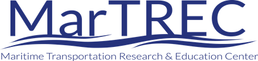
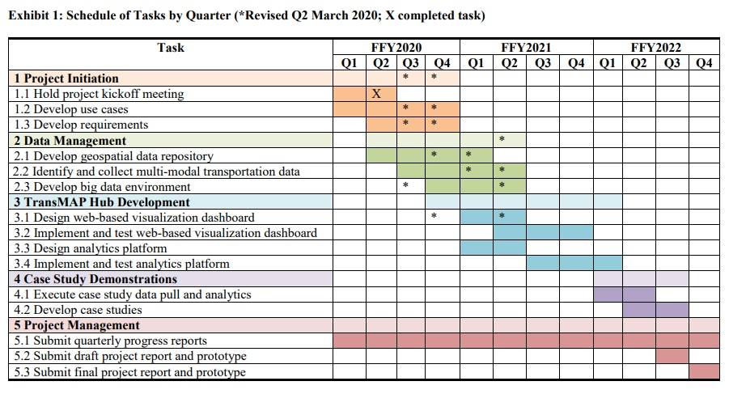

# Transportation and Maritime Analytics Partnerships Hub

Conducted through the Maritime Transportation Research and Education Center (MarTREC), the Transportation and Maritime Analytics Partnerships Hub (TransMAP) project is supported by the Maritime Administration of the U.S. Department of Transportation. The team, led by the University of Arkansas in partnership with the Texas A&M Transportation Institute, is working to make available large-scale data and visualization tools related to maritime freight transportation on infrastructure, systems, and networks accessible to humans and machines through the Internet of things, in order to enable improved resilience, planning, investment and operational decisions.

## Objectives

TransMAP’s goal is to develop a ‘visual decision space’ for effective planning, management, and advancement of efficient, resilient, and sustainable multimodal transportation systems including highway, rail, maritime, and pipeline. Efficient, resilient, and sustainable multimodal transportation is a national priority. To meet the challenging environment of the Nation’s complex and ever-changing transportation system, large-scale data sets need to be captured and analyzed to support research and planning, and made available for real-time access for use by government agencies, industry and citizens. Intelligently using big data is critical to manage, improve, maintain, design and build our transportation infrastructure.

The research objectives of the TransMAP Hub are

- Curate, archive, and disseminate transactional and dynamic data across multiple software platforms to make a variety of transportation data sets accessible on a real-time basis to government agencies, industry and citizens based on open source data management software tools and an open-access online visualization platform to collect, analyze, and disseminate transportation system performance data that supports efficient and accessible multimodal transportation.
- Improve visualization of physical and socioeconomic data related to multimodal transportation in three-dimensional space and over time through the development of cartograms for visualizing human geography, area-value data, and time as a cartographic variable.
- Develop interactive map animations so researchers, citizens, and current and future industries can access data-rich maps to make informed decisions for effective planning, management, and advancement of efficient, resilient, and sustainable multimodal transportation systems including highway, rail, maritime, and pipeline.

> It is worth emphasizing that the TransMAP Hub will not be a one-stop location to meet requirements for each common and specific need relevant to all potential stakeholders. Not only is this beyond the scope of this project, but it is also nearly impossible to effectively implement extensive and complex functionality within a single, mostly browser-based application. Instead, the focus here is to develop a range of possible engagements with these disparate datasets while allowing for nuance in specific project requirements

## MarTREC

### Maritime Transportation Research & Education Center

> Our vision is to be recognized as the Nation’s premier source for expertise on maritime and multimodal transportation research and education

The Maritime Transportation Research and Education Center (MarTREC) is a U.S. Department of Transportation Tier 1 University Transportation Center funded through the Office of the Assistant Secretary for Research and Technology. MarTREC is working to preserve the Nation’s transportation system through efficient, resilient, and sustainable maritime and multimodal logistics and infrastructure. The MarTREC consortium consists of renowned maritime transportation researchers dedicated to transferrable research and inclusive education and workforce development. Our consortium consists of the University of Arkansas, Jackson State University, Louisiana State University, Texas A&M University and Transportation Institute, University of New Orleans, and Vanderbilt University.

MarTREC conducts research in three critical areas

- **Maritime and Multimodal Logistics Management** enhances current understanding and facilitates improved operations within the nation’s multimodal supply chain networks
- **Maritime and Multimodal Infrastructure Preservation** advances state-of-the-art resilient multimodal transportation infrastructure preservation, repair, design, and construction
- **Disaster Response and Transportation Planning for Coastal and River Valley Communities** enables the resilience, safety, efficiency, and effectiveness of multimodal transportation systems during disaster response or other major events.

## Status of the Project

### Roadmap

