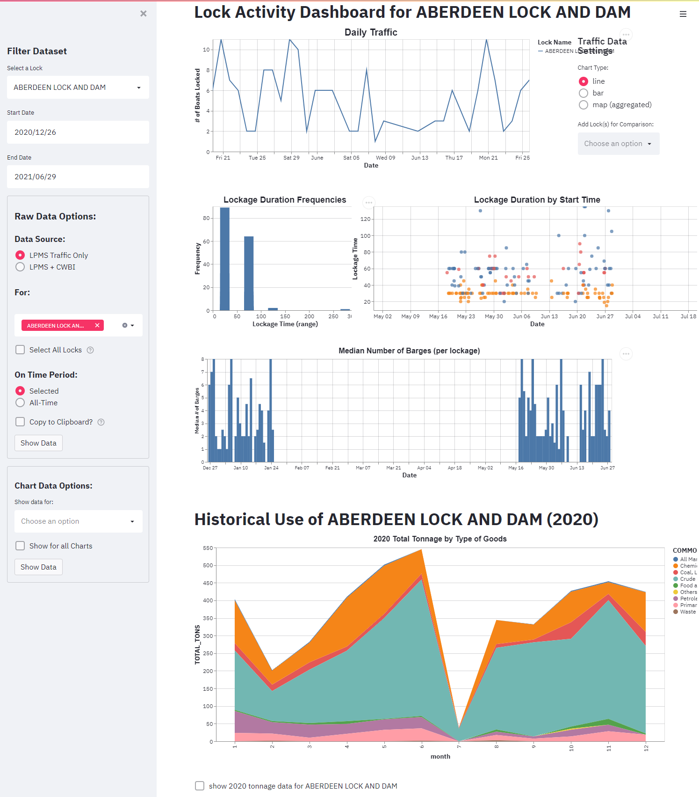

# TransMAP Analytics Hub

While the TransMAP Hub Explorer interface facilitates exploratory access to the TransMAP Hub Data Repository, the overall functionality for more intermediate and advanced consumers is somewhat limiting. Therefore, two approaches are currently under active development to accommodate researchers looking to gain deeper insights into the data repository without exporting and/or downloading entire datasets.

### Interactive Dashboards

Driven by the research objectives outlined in the various Use Cases, these interactive dashboards will be built using Streamlit.io to facilitate a guided, research focused exploration of specific datasets.


{ loading=lazy }


### Python API

With a focus on the TransMAP Hub Data Repository, a Python package is currently under development that will allow seamless imports of datasets hosted within the repository and easily queried directly into Pandas Data Frames.

When published, the package can be installed by running:

```bash
$ pip install transmap
```

And then importing using:

```python

from transmap import TransMAP

Map = TransMap(...)

```

### Jupyter Notebooks

[](https://mybinder.org/v2/gh/castuofa/transmap-examples/HEAD)

The TransMAP Python package will be used to develop a series of interactive Jupyter Notebooks, served initially through BinderHub, that will showcase Use Cases or a variety of methodologies within which to analyze the data repository without the need for additional setup or installations.

Examples of these will be linked within the "Notebooks" section of these documents and hosted on [Github - TransMAP Notebook Examples](https://github.com/castuofa/transmap-examples).


