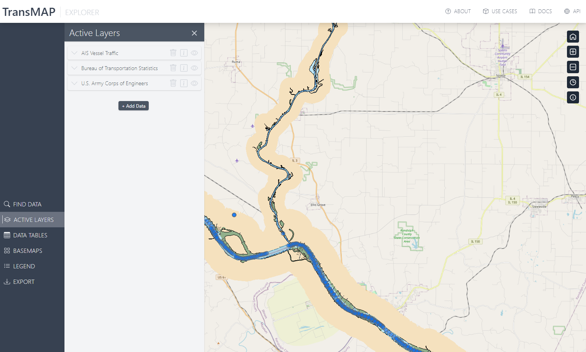
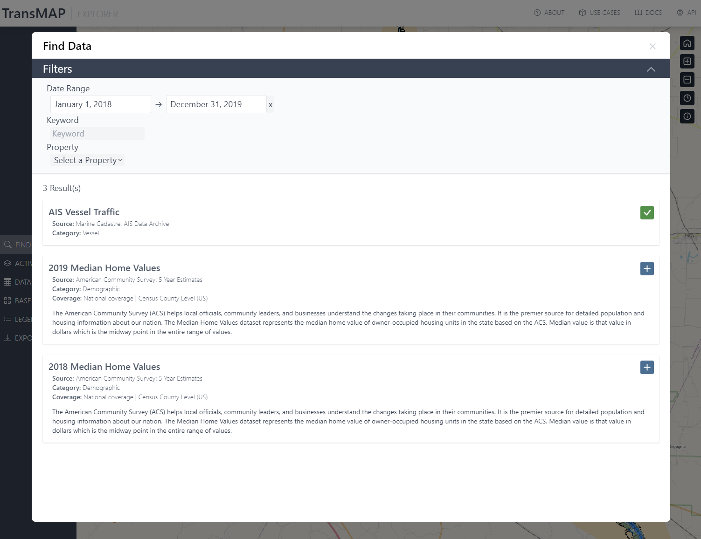
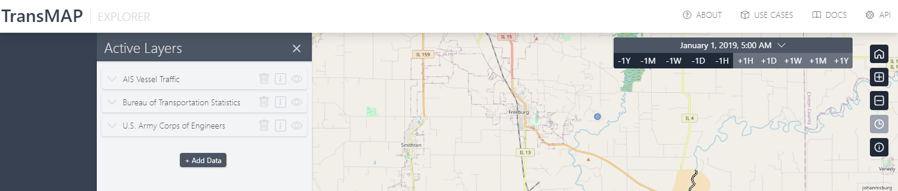
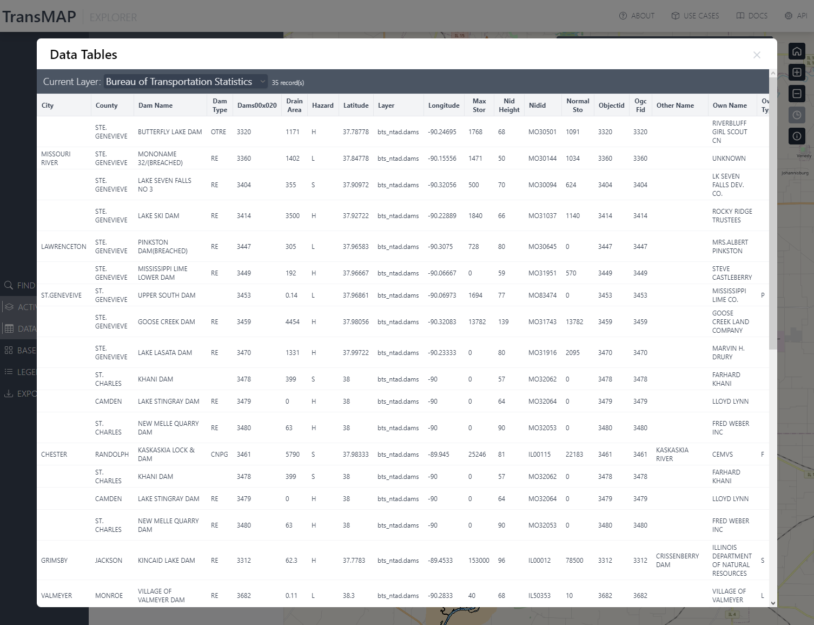
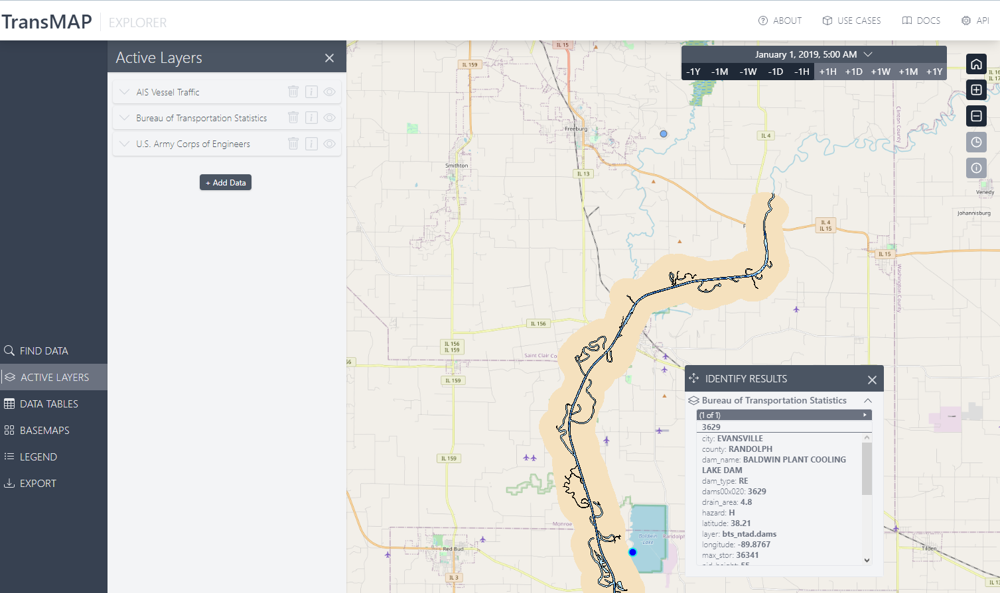

# TransMAP Hub Explorer

The Explorer interface is a browser accessible spatial/temporal data exploration tool that encourages visual interactions with the TransMAP Hub Data Repository. With a design focus similar to a wide variety of geospatial/GIS viewers, the data layers can be manipulated, reordered, toggled, features inspected, and downloaded alongside additional layers that can be added, filtered, or searched based on temporal extents and thematic groups. The Explorer is not intended as an analytical tool but was designed to allow fast inspection of available datasets in a given area during specific time period.

**Access the latest interface**: [TransMAP Hub Explorer](https://transmap.cast.uark.edu/)

{ loading=lazy }

### Finding Data

While the datasets are mostly tied to the Use Cases in some way, there are still multiple other datasets that can be added to the interface as desired. These can be explored in two ways - both of which query the same sources within the data repository.

1. Through the Explorer interface using the Find Data module
2. By exploring the TransMAP Hub Metadata interface

The Find Data module is a simplified filtering tool that allows the consumer to filter by date, theme, and keywords. Below is an example of how this module operates.

{ loading=lazy }

The TransMAP Hub Metadata platform is built with Geonetwork and provides an additional pathway to explore the multiple datasetss available within the TransMAP Data Repository.

It is worth noting that some of the returned datasets are pulling from third-party services - specifically OGC map services. While these help in visually exploring the available datasets, it is not currently possible nor within the scope of this project to extract and store these services as well. It was determined that these third party sources are reliable, rarely changing sources that provide more than adequate functionality on their own. Therefore, metadata sources are primarily links to these source locations but are provided within the TransMAP Explorer and Metadata Hubs for searching and filtering conveniences.

### Stepping Through Time

One of the key features of the Explorer interface is the ability to "step through time" when interacting with *time enabled* datasets. A common fixture of this type of dataset is the AIS Vessel Traffic data. Given the temporal resolution of this data, often sampled at 1 second intervals, it is important to aggregate these within most viewers or analytics platforms.

In the Explorer interface, these aggregations can be iterated through a variety of temporal steps including +/- 1hr, 1day, 1week, and 1year. When a time enabled layer is added to the interface, it immediately responds to the settings applied within the time step module.

Below is an example of the module:

{ loading=lazy }

### Data Inspection

There are two methods to explore the attributes behind a given dataset that is provided by the TransMAP Data Repository directly.

1. Data Tables
2. Feature Info

Within the "Data Tables" view, the various layers that have vector data, will display a **sample** (~100 rows) of the available attributes. This is formatted into an interactive table. See the following example:

{ loading=lazy }

!!! warning
    The data tables view does **not** include third-party image-based OGC services

By clicking on any feature within the interface, it's possible to inspect the properties of that specific feature. If available, the attributes will pop-up in a small information box.

{ loading=lazy }

### Downloading Data

The specifics for this module are still under active development and exploration. Updates will be provided here once the roadmap for this feature is completed.

