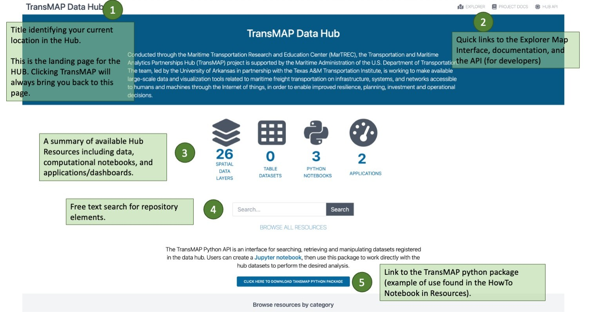
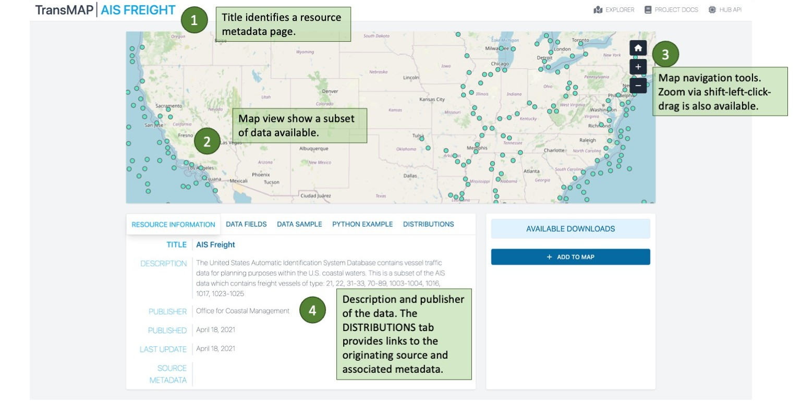
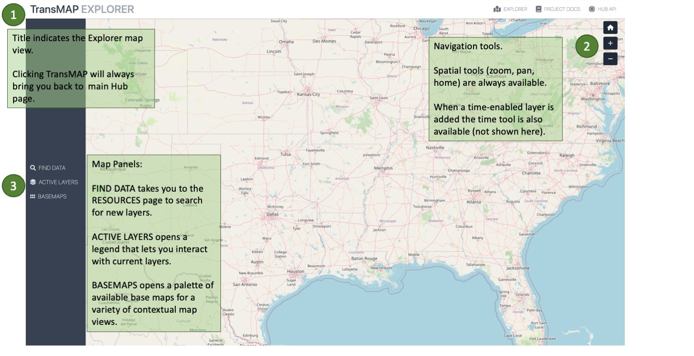
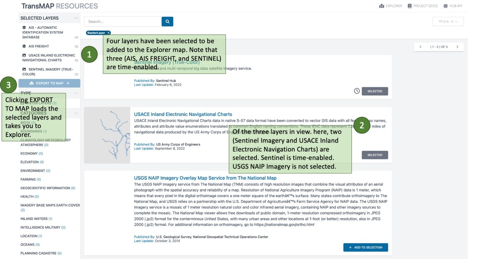
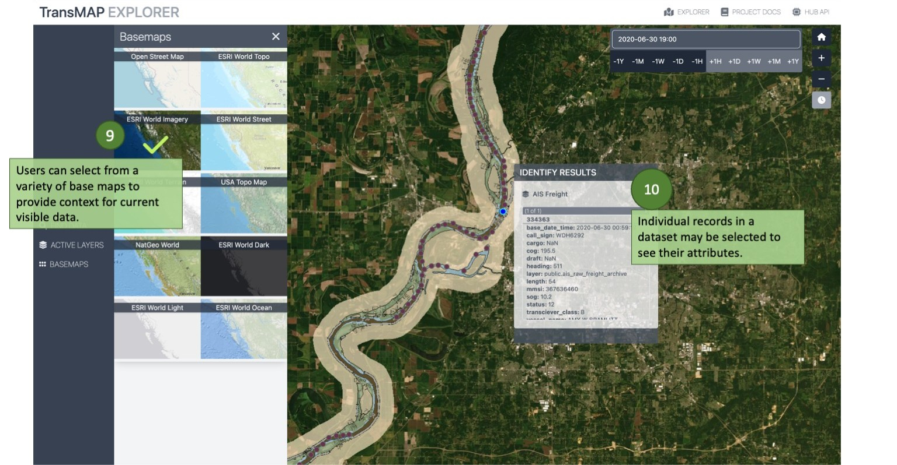
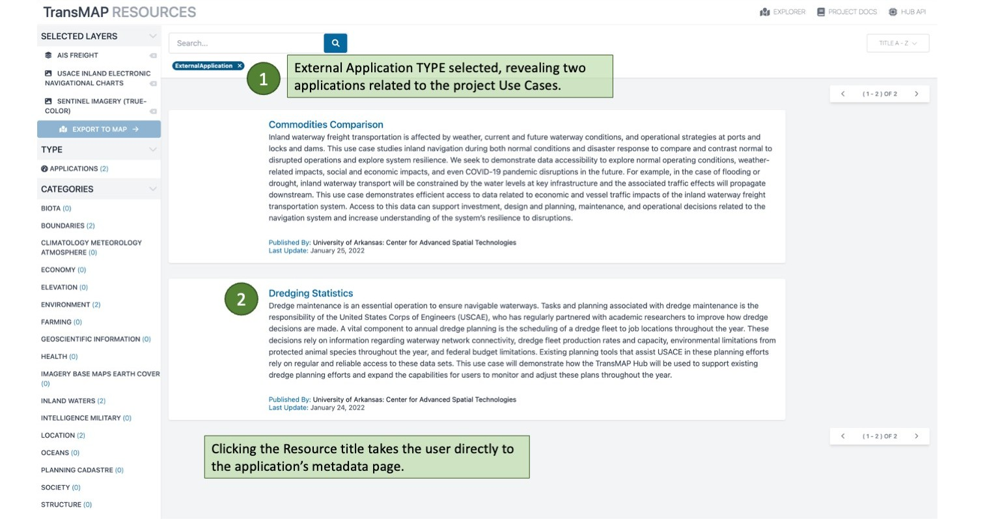
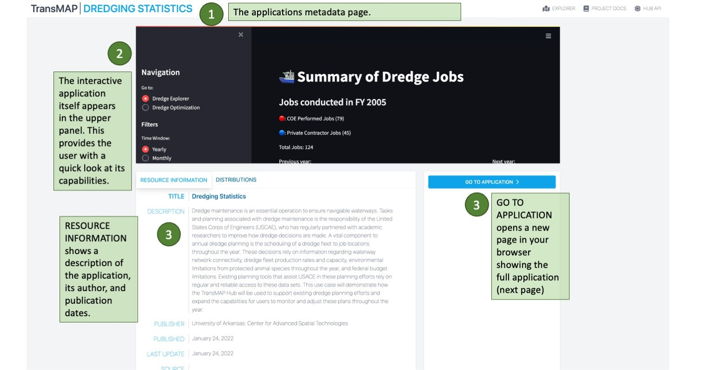
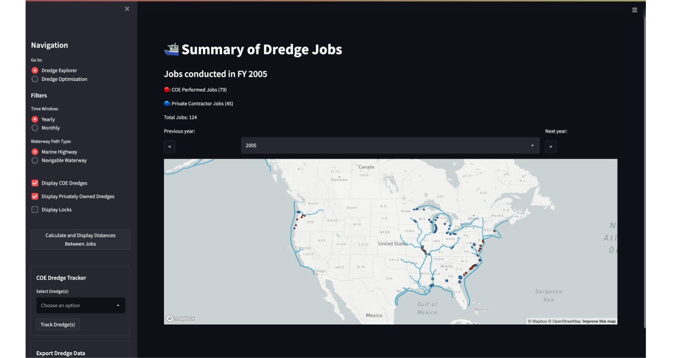

# TransMAP Hub Quick Start Guide (QSG)

TransMAP Hub is intended to serve a variety of communities, from the casual user looking for inland waterway related data resources to a data scientist trying to integrate and analyze heterogenous and complex data sources. At its core, it is a data repository containing

- maritime traffic related datasets from a variety of sources: USACE, NTAD, BTS
- contextual data from USGS, NOAA, and others.

Some of the data is stored directly in the Hub geospatial data repository. Other data is drawn directly from the originator. This last category is useful in that the TransMAP user has access to the latest data updates. Most of the data sources fall into this last category. Notable acceptions include the historic AIS datasets and USACE LPMS data. The latter has been archived in the Hub over the course of the project because its API does not provide access to historic data.

The Hub is organized as a broswer application that gives access to intergrated and interactive resources:

- TransMAP Hub
  - Resources
    - Spatial data layers
    - Tabular (non-spatial) data layers
    - Python Notebooks
    - Applications (related to Use Cases but expandable)
  - Explorer
    - View and interact with Data Layers
  - Metadata
    - Resource-specific information on data publishers, currency, and links to original data
  - TranMAP API
    - transmap python package providing methods to access, extract, and explore data layers

While the TransMAP Hub Explorer interface facilitates exploratory access to the TransMAP Hub Data Repository, the overall functionality for more intermediate and advanced consumers is somewhat limiting. Therefore, two approaches - python notebooks and the transmap python package - are currently provided to accommodate researchers looking to gain deeper insights into the data repository without exporting and/or downloading entire datasets.

## TransMAP Hub: Main Page
  
||
|:-:|
||
|:-:|

  
## RESOURCES: Overview

The RESOURCES is where you search for Hub resources. Resources consist of four distinct things:

- Spatial data layers: datasets with goemetry fields that allow them to be manipulated using spatial data analysis tools in R and Python, imported into any GIS application, and viewed in the TransMAP Explorer
- Tabular data layers: datassets with no geometry field.
- Python Notebooks: Jupyter notebooks, documents that can integrate structured text, equations, images, tables, and *active python code*. These notebooks are targeted at data scientists. Use Cases employ notebooks that show how the data supporting the study was access, analyized, and presented.
- Applications: Also called dashboards, applications are purpose-built to support a particular set of analyses. Two of the Use Cases use Streamlit (a pytyon-based library) to build interactive dashboards.

||
|:-|

## RESOURCES: Metadata

Each resource, no matter it's type or category, has an associated metadata page that contains information about the source of the resource, its currency, and links to the publishers service or website. It also allows for a preview of the data and links for download (if applicable) and adding to Explorer.

||
|:-:|
||
|:-:|

## RESOURCES: Filtering

We revisit the RESOURCES to see the effects of adding filters via the TYPES and CATEORIES breakdown on the left vertical panel.

||
|:-:|
||
|:-:|

## EXPLORER: Overview

Before you add layers to Explorer, take a moment to orient yourself to the Explorer map interface.

||
|:-:|

## RESOURCES: Adding Layers

The RESOURCES page in a state showing four data layers ready to add to Explorer

||
|:-:|

## EXPLORER: Feature Highlights

The next three views highlight various aspects of Explorer. One of the key elements of Explorer is its ability to explore historical datasets.

||
|:-:|

||
|:-:|

||
|:-:|

## EXPLORER: Basemaps

Explorer can draw on several basemaps that provide context to the maritime data. The light and dark maps allow a user to focus on the data. The topogrpahic maps show elevation changes while the street maps show the urban and regional built environment. Aerial imagery highlights landcover.

||
|:-:|

## RESOURCES: Python Notebooks

Notebook resources can be seen by filtering on TYPE Python Notebooks. They also have their own metadata pages from which the GitHub repository where the notebook resides can be accessed.

||
|:-:|

||
|:-:|

||
|:-:|

## RESOURCES: Applications (Dashboards)

Another type of resource in TransMAP are applicatins (or dashboards) build using a python package called Streamlit. These applications access Hub datasets and use them to perform analysis and visualization, answering specific questions. The current applications are related to two Use Cases.

||
|:-:|

||
|:-:|

|
|:-:|
