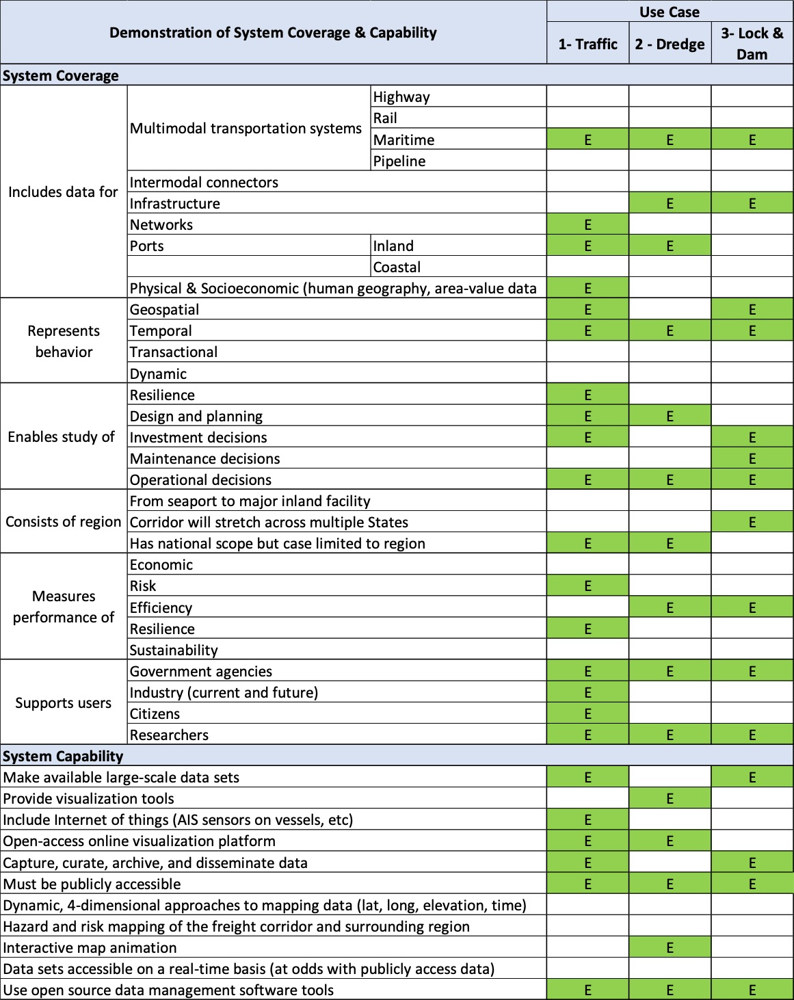

# Use Coverage Matrix

The Use Case Coverage Matrix shows how each of the following use cases will demonstrate TransMAP Hub’s
system coverage and capabilities:

1. [Use Case One: Economic Impacts](/transmap/use_cases/one)
2. [Use Case Two: Dredging Statistics](/transmap/use_cases/two)
3. [Use Case One: Seasonal Lock Usage](/transmap/use_cases/three)

The level of demonstration is indicated as **E** if the use case is expected to demonstrate an element, **P** if the use case may possibly demonstrate an element, and left blank if the use case is not expected to demonstrate an element in the matrix. Highlights of the system coverage and capability of the use cases is discussed below:

- As expected, all three use cases will cover data for the maritime transportation system. Highway and rail coverage will be demonstrated as data is available. None of the use cases will explicitly demonstrate pipeline as this system operates independently of the maritime freight system and associated data is not freely available.
- The use cases will demonstrate coverage of infrastructure, network, inland and coastal ports, and physical and socioeconomic data. However, given that unrestricted and comprehensive data associated with intermodal connectors was not identified, it is anticipated that the TransMAP Hub and the use cases will not contain this data.
- The use cases will represent TransMAP Hub data behavior with geospatial, temporal, transactional, and dynamic characteristics.
- Collectively, the use cases will demonstrate how TransMAP Hub enables the study of resilience, design and planning, investment, maintenance, and operational decisions.
- The use cases will demonstrate how TransMAP Hub is designed to show a freight corridor that stretches across multiple states and has a national scope. It is possible that Use Case One will represent a region of interest from a seaport to an inland facility assuming representative data is available.
- The use cases will demonstrate how TransMAP Hub can measure maritime freight system performance across multiple metrics including economic, efficiency, resilience, sustainability, and possibly, risk.
- The use cases will demonstrate how a variety of users including government agencies, industry, researchers, and private citizens will interact with TransMAP Hub.
- As a whole, all three use cases will demonstrate TransMAP Hub’s capabilities related to large-scale data sets, visualization tools, open online access, data management, access to publicly available data, and open source tool platform.
- It is anticipated that at least one use case will include the internet of things, hazard and risk mapping, and interactive map animation.
- Given the requirement that TransMAP Hub provide access to free and unrestricted data, TransMAP Hub is not expected to make real-time data available based on a lack of existing access to such data sets. It is possible that the Hub may make a new data set possible through collection of real-time data from the Lock Queue Report.

## Capability Matrix

{ loading=lazy }

